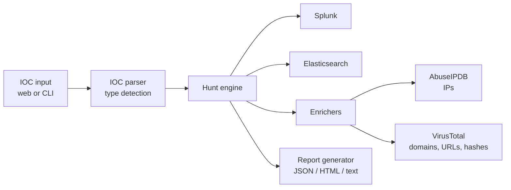

# Threat Hunter

Automated IOC hunting for SOC analysts. Paste a list of indicators of compromise, search them across Splunk or Elasticsearch, enrich them with VirusTotal and AbuseIPDB, and export an incident report in JSON, HTML, or plain text.

Built with Python, Flask, and Click as part of my move from Android engineering into security operations.


## The problem

During an investigation, an analyst often has a handful of indicators (IPs, domains, hashes, emails) and needs to answer the same questions for each one: does it appear in our logs, how often, and what does threat intelligence say about it? Doing that by hand means one SIEM query per indicator, copying results between browser tabs, and writing the report afterwards.

Threat Hunter runs that loop in one step and produces the report at the end.

## Features

- **IOC detection:** classifies each input as IPv4, IPv6, domain, URL, email, MD5, SHA1, or SHA256 using regex patterns
- **Multi-SIEM hunting:** Splunk and Elasticsearch backends behind a common hunt engine
- **Threat intelligence enrichment:** AbuseIPDB for IP addresses, VirusTotal for domains, URLs, and file hashes
- **Risk scoring:** each IOC is rated High, Medium, or Low by how often it appears in the SIEM
- **Reports:** download results as JSON, HTML, or text
- **Two interfaces:** a web dashboard (Flask) and a command-line tool (Click)
- **Secrets handling:** API keys load from `.env`, which is git-ignored, and never appear in code
- **Fault-tolerant enrichment:** a failed or timed-out API call is logged and marked on that IOC instead of stopping the whole hunt
- **21 unit tests** across the parser, hunt engine, enrichers, and report generator

## Architecture



```
threat_hunter/
├── core/            config loading, IOC parser, hunt engine
├── integrations/    Splunk and Elasticsearch clients (with demo mode)
├── enrichers/       VirusTotal and AbuseIPDB clients
├── generators/      report generator
└── web/             Flask app and dashboard
tests/               21 unit tests
```

## Demo

The screenshots show a hunt over four indicators. Two of them come from my [Splunk BOTS v3 investigation](https://github.com/Ahsan668/splunk-bots-investigation) of the Frothly breach. The domain and email are sample indicators included to exercise the other IOC types.

> **Demo mode:** the Splunk and Elasticsearch clients ship with a demo mode that returns simulated hit counts, so the project runs without a live SIEM. The numbers in the screenshots come from demo mode, not from a real Splunk search. Enrichment calls are real when API keys are configured.

| Dashboard | Enrichment |
|---|---|
|  |  |

| HTML report | Flask API log |
|---|---|
|  |  |

See [RESULTS.md](RESULTS.md) for how the demo indicators relate to the Frothly breach.

## Quick start

Requires Python 3.8 or newer.

```bash
git clone https://github.com/Ahsan668/threat-hunting.git
cd threat-hunting
pip install -r requirements.txt
pip install -e .

cp .env.example .env    # then add your API keys
```

`.env`:

```
VIRUSTOTAL_API_KEY=your_key_here
ABUSEIPDB_API_KEY=your_key_here
```

Both keys are free to obtain. Without them, hunting still works and enrichment reports `no_api_key`.

Start the dashboard:

```bash
python -m threat_hunter.web.app
```

Then open http://127.0.0.1:5000.

Or hunt from the command line:

```bash
python -m threat_hunter hunt-file --file examples/frothly_iocs.json --enrich --report html
```

Full instructions for the dashboard, the CLI, and configuration are in [docs/USAGE.md](docs/USAGE.md).

## Tests

```bash
python tests/test_ioc_parser.py         # 5 tests
python tests/test_hunt_engine.py        # 4 tests
python tests/test_enrichers.py          # 6 tests
python tests/test_report_generator.py   # 6 tests
```


## What I learned

- Designing a pluggable backend so a new SIEM can be added without touching the hunt logic
- Keeping secrets out of source control with environment variables and `.gitignore`
- Isolating third-party API failures so one slow enrichment call doesn't break a hunt
- Debugging Windows-specific problems: antivirus file corruption, PowerShell string escaping, and Flask template paths when running as a module

## Roadmap

- Live Splunk and Elasticsearch queries using the REST APIs (currently demo mode)
- Time-window filtering on hunts
- Risk scoring that combines SIEM hit count with threat intelligence reputation
- Bulk import of IOCs from STIX or CSV threat feeds

## License

MIT. See [LICENSE](LICENSE).
